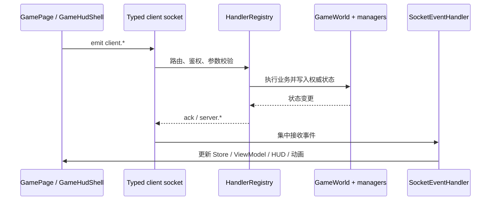

# 当前运行时架构

> 本文以 2026-08-14 工作目录中的源码和 package scripts 为准。只描述 `packages/shared`、`packages/server`、`packages/client` 三个运行时包。历史/规格文档保留原有历史语义，但不作为运行时事实。

## 一页概览

`@game/shared` 是无 game 包依赖的契约与数据工具层；`@game/server` 通过 Express、Socket.IO 和 `GameWorld` 持有服务端权威；`@game/client` 通过 Vite 提供原生 TypeScript/DOM/CSS 客户端，消费服务端事件并投影到 `GameStore`、`GameViewModel`、HUD 和 Canvas。客户端与服务端各使用一条 Socket.IO 连接。

```mermaid
graph LR
  Shared[@game/shared\n类型 / 地图解析 / i18n / debug]
  Server[@game/server\nExpress / Socket.IO / GameWorld / handlers]
  Client[@game/client\n页面 / Store / ViewModel / Canvas]
  Files[map.json / map-meta.json / behaviors]
  Client --> Shared
  Server --> Shared
  Files --> Server
  Server <--> |client.* / server.*| Client
```

## 组合根与启动链

### 根脚本

- `package.json` 的 `dev` 调用 `scripts/dev-services.mjs`，并行执行 `packages/server` 与 `packages/client` 的 `npm run dev`。
- `build:shared`、`build:server`、`build:client` 分别进入对应包执行真实构建。
- `lint` 和 `test` 依次覆盖 shared、server、client；没有单独的 typecheck script。

### 服务端

```text
packages/server/src/index.ts: bootstrap()
  -> loadConfig()
  -> createApp(config)
     -> Express / HTTP / Socket.IO
     -> GameWorld + 地图解析
     -> Mortgage / Taxation(map-meta taxConfig) / Bankruptcy
     -> HandlerRegistry
     -> DayNightCycle / TimeZoneManager / ProsperityManager
     -> BehaviorEngine / EraManager / PlayerStore
  -> startHttpServer()
  -> SIGINT/SIGTERM gracefulShutdown()
```

`app.ts:createApp` 是组合根：创建对象、配置依赖注入和连接注册，但不监听端口。地图从 `config.mapPath` 与 `config.mapMetaPath` 读取；缺失地图时，服务端保留 HTTP/Socket 启动，但地图相关能力可能不可用。

计税配置只在组合根从实际 `MapMeta.config.taxConfig` 读取并完整传入 `Taxation`；计税模块不再持有地图元数据更新入口，昼夜循环也不负责计税。

### 客户端

```text
packages/client/src/main.ts: bootstrap()
  -> GameController(state=start)
  -> StartPage -> LoginPage -> LoadingPage -> GamePage
  -> LoadingPage:createSocket() 创建唯一连接并 client.login
  -> GamePage 复用连接
  -> registerSocketHandlers()
  -> GameStore / GameViewModel
  -> GameHudShell + ClientRenderLoop + BoardRenderer
```

## Socket 注册链

服务端唯一生产连接注册点在 `app.ts`：

```text
io.on('connection', socket)
  -> socketManager.registerConnectionHandlers(socket)
     -> SocketManager.onConnection()
     -> 核心 ping/login、连接绑定/断开、鉴权/限流
  -> handlerRegistry.registerForSocket(socket)
     -> DiceHandler / MovementHandler / PropertyHandler
     -> StartHandler / JailHandler / InvestmentHandler
     -> TransportHandler / MonumentHandler / TeamHandler
     -> chat / bankruptcy restart
     -> debugHandler（仅调试开关满足时）
  -> app.ts 注册 triggerSettlement 调试处理器
```

协议类型集中在 `packages/shared/src/types/socket-events.ts`。客户端在 `LoadingPage` 创建 typed socket，在 `GamePage` 调用 `registerSocketHandlers`；`SocketEventHandler` 以 `WeakSet` 防止同一 socket 重复注册，离开页面调用注销函数。

## 服务端权威流

客户端只发起 `client.*` 请求或查询；handler 从 `socket.data.playerId` 获取身份，读取 `GameWorld` 和各管理器，校验权限、位置、冷却、余额和业务约束，再写入服务端状态。随机骰子、移动最终位置、地产与投资、抵押、税收、破产、队伍共享数值、繁荣度和时代状态均以服务端结果为准。当前运行时不提供贷款、还款、利息或银行账户机制。



`server.*` 事件可能是完整快照、增量值变化、动作结果、通知或动画提示。ack 用于请求结果和错误反馈，不替代最终状态事件；客户端不得在 ack 前自行修改金钱、信用、位置、所有权或破产状态。

## 客户端状态投影与渲染链

`SocketEventHandler` 将 `server.gameState`、`server.playerMoved`、`server.valueChanged`、`server.playerStatusChanged`、`server.teamUpdated`、昼夜和繁荣度事件转写为 `GameStore` 状态；必要时调用 `requestHudRefresh`、移动动画、通知或聊天系统。`GameViewModel` 是 `GameHudShell` 的状态桥梁，按切片通知订阅者，不依赖 Socket 或具体 UI。

```text
server.*
  -> SocketEventHandler
  -> GameStore setters / team/chat/movement systems
  -> ClientHudBridge -> GameViewModel.sync -> GameHudShell
  -> ClientRenderLoop -> BoardRenderer -> Cell/Connection/Player/DayNight/Vision
```

Canvas 的每帧循环只读取投影后的状态，更新移动动画、相机和棋子，再调用 `BoardRenderer.render()`。地图由 `MapLoader` 请求 `/api/map`，经 shared 的解析工具标准化为 `MapIndex` 后交给渲染器。

## 删除边界

- item、talent、achievement 已从当前运行时的 shared 类型、Socket 契约、服务端注册链和客户端主链移除；旧历史/规格文档仍不构成运行时事实。
- 服务端与客户端运行时配置目录不再保留 `achievements.json`；`ai-bot` 与 `ai_bot_try` 不属于本次清理边界。
- 破产重开仍是基础 Player 状态流程，不等同于复活令或成就/天赋保留机制。

## 残余技术债

- `GamePage` 仍承担页面组合、兼容状态和部分业务接线，`GameStore` 与 `GameViewModel` 并存。
- `packages/client/src/state/GameStore.ts` 仍是模块级状态；部分旧 hooks/旧 HUD 文件保留但不是主链。
- `NotificationManager`、部分认证/持久化能力和若干配置文件存在，但是否进入生产链需以 `app.ts` 与具体 handler 的注册为准。
- `REDIS_URL` 在配置类型和文档中存在，当前 app 未建立 Redis 适配器；不能描述为已实现多实例同步。
- 服务端存在 REST 地图读取与 Socket 状态两条输入来源，客户端地图请求失败时的回退逻辑增加了状态排查成本。

## 关联文档

- [API.md](./API.md)
- [FILE_MAP.md](./FILE_MAP.md)
- [开发者指南](../guides/DEVELOPER.md)
